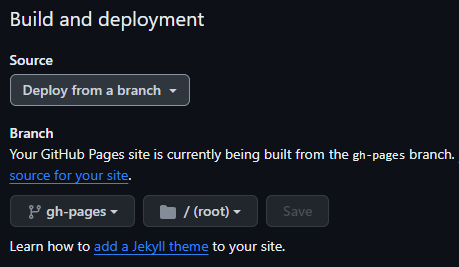

# Burger House Landing App

This project was generated with [Angular CLI](https://github.com/angular/angular-cli) version 16.2.12.

## Development server

Run `npm install` to install all the necessary npm packages.

Run `ng serve --open` for a dev server. The server will automatically open in the browser at `http://localhost:4200/`. The application will reload automatically if you make any changes to the source files.

## Code scaffolding

Run `ng generate component component-name` to generate a new component. You can also use `ng generate directive|pipe|service|class|guard|interface|enum|module`.

Example:

Run `ng generate service App` to generate `app.service.ts` file to store the logic of connecting to the backend there

## Build and Deploy to GitHub Pages

1. Increase size of the application up to 1mb in `angular.js` to get rid of build warnings:

```
"budgets": [
  {
    "type": "initial",
    "maximumWarning": "1mb",
    "maximumError": "1mb"
  },
  {
    "type": "anyComponentStyle",
    "maximumWarning": "1mb",
    "maximumError": "1mb"
  }
],
```

2. Make sure that `src\index.html` file uses root directory: 
```
<base href="/">
```

3. Setup GitHub Pages

https://medium.com/tech-insights/how-to-deploy-angular-apps-to-github-pages-gh-pages-896c4e10f9b4

#### First time setup

```
// create gh-pages branch and switch to it
git checkout -b gh-pages

// push the existing code to gh-pages branch
git push origin gh-pages

// install 'angular-cli-ghpages' globally
npm install -g angular-cli-ghpages

// build your angular app with --base-href flag
ng build --configuration=production --base-href https://[username].github.io/[reponame]/

// push the built code located in dist/[project-name] folder to GitHub Pages
ngh --dir=dist/[project-name]
```

*ngh - means angular github pages*

#### Subsequent deploys

```
ng build --configuration=production --base-href https://[username].github.io/[reponame]/
ngh --dir=dist/[project-name]
```

4. Check GitHub Pages Settings of your repo - `https://github.com[username]/[reponame]/settings/pages`. The branch should be `gh-pages` and `root` as the source folder:



5. Check your deployment:

    `https://github.com/YOUR_USERNAM/YOUR_REPONAME/deployments`

    or

    `https://YOUR_USERNAM.github.io/YOUR_REPONAME/`

## Further help

To get more help on the Angular CLI use `ng help` or go check out the [Angular CLI Overview and Command Reference](https://angular.io/cli) page.
